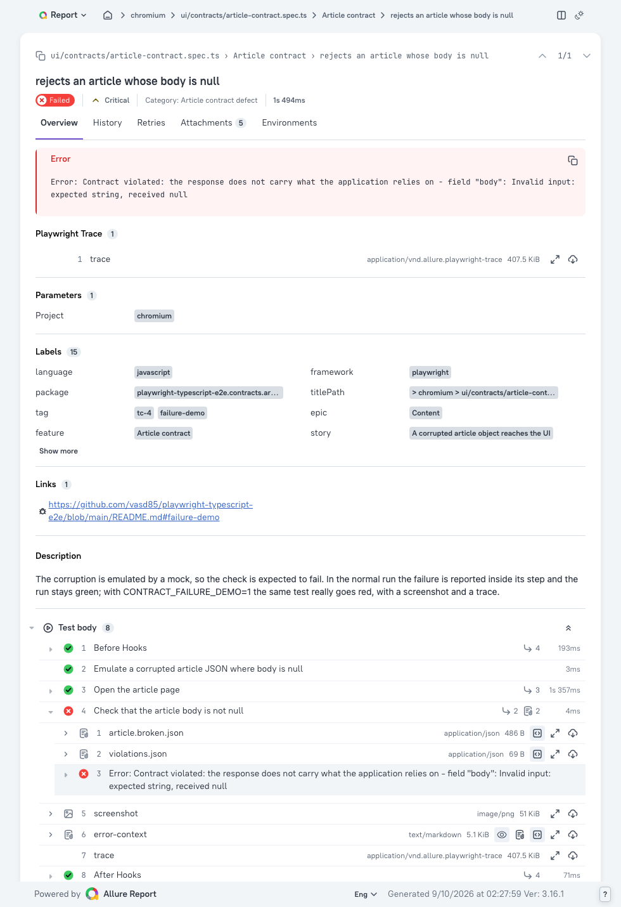
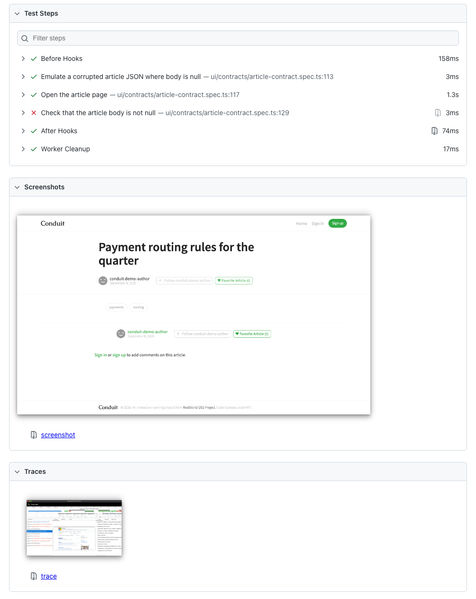

`npm test` — все тесты зелёные, код выхода 0; `npm run test:failure-demo` — ровно один красный тест (ТК4, контракт `body`), ненулевой код выхода, скриншот и трейс.

# E2E- и API-автотесты Conduit на Playwright и TypeScript

Набор проверяет публичное демо RealWorld (Conduit): регистрацию через форму, редактор статей,
подмену списка тегов, поведение приложения на повреждённом объекте статьи и контракт этого объекта,
а сверх задания — чистые API-тесты и оформленный дефект стенда.

Приложение под тестом: `https://demo.realworld.show`, его API: `https://api.realworld.show/api`.
Стенд публичный и общий: на нём одновременно работают посторонние люди, и это влияет на прогон —
подробности в разделе «Ограничения демо-стенда».

Найденный дефект стенда оформлен в [DEF-001](docs/defects/DEF-001-token-collision.md) вместе со
скриптом воспроизведения.

Рядом лежит [ARCHITECTURE.md](ARCHITECTURE.md) — он к этому набору отношения не имеет и его код не
описывает. Это ответ на вторую, проектную часть задания: как строить e2e-тесты для другого,
вымышленного приложения — CMS, переезжающей с AngularJS на Angular внутри монорепозитория Nx.

## Запуск локально

Нужен Node.js 24 или новее. Переменные окружения не обязательны: без `.env` набор идёт против
публичного демо.

Установить зависимости в `node_modules` этого проекта — точные версии из `package-lock.json`, ничего глобального:

```bash
npm ci
```

Поставить браузер:

```bash
npx playwright install chromium
```

Прогнать весь набор:

```bash
npm test
```

Открыть встроенный отчёт после прогона:

```bash
npx playwright show-report
```

Отдельные части набора: `npm run test:unit` — проверки самого каркаса без браузера и без стенда;
`npm run test:ui` — режим Playwright UI; `npm run lint` — ESLint и Prettier; `npm run typecheck` —
компилятор TypeScript в строгом режиме.

Один пункт задания запускается по тегу: `npx playwright test --grep @tc-2`. Теги в наборе —
`@tc-1`, `@tc-2`, `@tc-3`, `@tc-4` (пункты задания), `@arch-1` (авторизация один раз на воркер),
`@extra` (API-тесты) и `@failure-demo` (тест, чьё падение показывает демонстрационная команда).

Отдельный слой запускается по проекту, но с оговоркой: проекты `chromium` и `api` объявлены
зависимыми от `setup`, а `api` — ещё и от `chromium`, поэтому `npx playwright test --project=api`
поднимает всю цепочку и выполняет 24 теста. Восемь API-тестов сами по себе даёт
`npx playwright test --project=api --no-deps`; правда, без `setup` сессии воркеров придётся завести
фикстуре, и API-тесты это умеют.

Обе зависимости стоят не для порядка. `setup` заводит сессии воркеров до того, как начнутся тесты.
Зависимость от `chromium` — планировочная, а не по данным: API-тесты регистрируют одноразовые
аккаунты в каждом тесте, и, идя после браузерных, они не попадают в те секунды, когда сценарий
регистрации получает свой токен через форму. Две регистрации в одну секунду делят токен (DEF-001),
и это единственный способ развести их, не трогая сам сценарий. Цена измерена и видна в сводке:
если браузерный тест покраснел, проект `api` не запускается вовсе — Playwright пропускает проект,
чья зависимость упала.

## Запуск в Docker

Нужен клон репозитория и Docker; Node и браузеры на машине не нужны.

Собрать образ:

```bash
git archive HEAD | docker build -t conduit-e2e -
```

Контекст сборки — закоммиченное дерево, поэтому собирается ровно то, что получит клонировавший
репозиторий; из каталога, скачанного архивом, команда не сработает, ей нужен git. Собрать образ надо
до первой команды `docker compose`: без готового образа compose соберёт его сам из рабочего каталога.

Внутри образа Node.js v24.18.1, его печатает `docker run --rm conduit-e2e node -v`.

Прогнать весь набор:

```bash
docker compose run --rm e2e
```

Демонстрация падения — та же команда с другим скриптом:

```bash
docker compose run --rm e2e npm run test:failure-demo
```

Встроенный отчёт, трейсы и `allure-results` пишутся в примонтированные каталоги и остаются на хосте
после удаления контейнера. Если в проекте уже выполнен `npm ci`, они открываются командами раздела
«Отчёты и трейсы». Если нет — оба отчёта раздаёт тот же образ:

```bash
docker compose run --rm -p 8080:8080 allure
docker compose run --rm -p 9323:9323 e2e npx playwright show-report --host 0.0.0.0
```

Первая собирает и раздаёт Allure на `http://localhost:8080`, вторая — встроенный отчёт с трейсом
упавшего теста на `http://localhost:9323`; обе проверены запросом с хоста. Флаг `-p` обязателен:
объявленный сервисом порт при `docker compose run` сам не публикуется — измерено, ответа нет.

Настройки `ipc: host` и `init: true` заданы в описании сервиса: флагов для них у подкоманды нет,
`docker compose run --ipc=host` отвечает `unknown flag: --ipc`. Первая даёт Chromium разделяемую
память сверх умолчания контейнера, вторая — обработку сигналов; обе по рекомендации Playwright.

`BASE_URL`, `API_URL` и `CONTRACT_FAILURE_DEMO` пробрасываются в контейнер, когда заданы. Учтите:
Compose берёт их не только из окружения, но и из файла `.env` рядом с `docker-compose.yml`
(проверено прогоном), поэтому при наличии `.env` контейнерный прогон ведёт себя ровно как локальный.

Прогон измерялся на Docker Desktop для macOS, где владелец записанных на хост файлов подставляется
сам. На Linux с Docker Engine каталоги отчётов, которых в свежем клоне нет, создаст демон от root, а
процесс в контейнере идёт под пользователем образа (uid 1001) — запись упадёт. По документации
Docker лечится добавлением `--user` к любой из команд выше; проверить было не на чем, Linux-машины
под рукой нет:

```bash
mkdir -p test-results playwright-report allure-results allure-report
docker compose run --rm --user "$(id -u):$(id -g)" e2e
```

<a id="failure-demo"></a>

## Как выглядит пойманный дефект

Контрактный тест ТК4 работает в двух режимах, и переключает их переменная `CONTRACT_FAILURE_DEMO`.
В обычном прогоне он зелёный: ожидаемое падение объявлено `test.fail` внутри шага, непосредственно
перед единственной проверкой, поэтому «зелёный» здесь означает «проверка контракта сработала».
Демонстрационный режим показывает то же падение по-настоящему:

```bash
npm run test:failure-demo
```

Команда даёт ненулевой код выхода и ровно один красный тест. Вот что попадает в отчёты. Снимки ниже
сняты с них, но снимок ничему не свидетель: увидеть красное можно только выполнив команду самому.

В Allure — красный шаг с бизнес-текстом нарушения, слепком ответа и списком нарушений схемы:



Во встроенном отчёте — тот же шаг, скриншот момента падения и трейс:



**Повреждение здесь эмулировано моком:** ответ подменяется зафиксированным в репозитории слепком
`tests/ui/contracts/article.broken.json`, где `body` равен `null`. Настоящий стенд такого объекта не
отдаёт, чинить на нём нечего.

Слепок взят намеренно — вместо того чтобы брать живой ответ стенда и портить в нём одно поле.
Причина в диагностике. При правке живого ответа тест зависел бы от того, отдал ли стенд статью
вообще; не отдал бы — портить оказалось бы нечего, `body` всё равно оказался бы не строкой, и тест
сообщил бы о нарушении контракта. То есть при недоступности стенда мы получили бы обвинение
приложения в дефекте, которого нет, — причём тем самым сообщением, ради которого этот кейс и сделан.
Слепок лежит в репозитории, поэтому проверяется ровно то, что заявлено: как приложение обходится с
повреждённым объектом.

Этим же механизмом сопровождается настоящий дефект — не разово, а по шагам, пока его не починят:

1. Тест поймал дефект и покраснел.
2. Дефект заведён документом с шагами воспроизведения — как [DEF-001](docs/defects/DEF-001-token-collision.md).
3. Проверка получает `test.fail(true, 'DEF-N: …')` внутри своего шага и статическую аннотацию
   `issue` со ссылкой на дефект. Прогон снова зелёный, но шаг в отчёте красный, и дефект виден.
4. Когда дефект починят, первый же прогон краснеет с текстом `Expected to fail, but passed.`:
   метку пора снимать. Это строгий режим, как `xfail(strict=True)` в pytest.
5. Метка снимается, дефект закрывается.

В репозитории этот механизм применён только к ТК4. Единственный подтверждённый дефект стенда
(DEF-001) закрыт не меткой, а обходом в коде, и по другой причине: пометить тест «ожидаемо красным»
значило бы оставить набор неработоспособным. Коллизия токенов ломает не один сценарий, а саму
возможность вести несколько сессий сразу, то есть параллельный прогон, которого требует задание.
Такой дефект приходится обходить, а не помечать.

## Отчёты и трейсы

Прогон пишет встроенный html-отчёт, `allure-results` и машинно читаемый json.

- `npx playwright show-report` — встроенный отчёт: шаги, вложения, скриншот и трейс упавшего теста.
- `npm run report:allure` собирает Allure-отчёт, `npx allure open allure-report` его открывает.
  В отчёте проставлены epic, feature, story, severity, окружение прогона и категории дефектов.
- `npx playwright show-trace` открывает трейс локально, без интернета. Тот же файл принимает
  [trace.playwright.dev](https://trace.playwright.dev): страница открывается в браузере и предлагает
  перетащить на неё файл трейса. На самой странице сказано, что она никуда трейс не отправляет и
  открывает его локально.

Трейс сохраняется только для упавших тестов, скриншот — только при падении, видео выключено:
трейс уже содержит и снимки экрана, и снапшоты DOM.

## Переменные окружения

Обязательных нет. `.env` не обязателен; если он есть, значения из него применяются, а переменные
самого окружения имеют приоритет. Пустое значение равнозначно отсутствию и означает «взять
умолчание». Схему разбирает `src/config/env.ts` при импорте, поэтому неверное значение роняет и
прогон, и перечисление тестов, называя переменную. Готовый шаблон с теми же тремя переменными и
пустыми значениями лежит в `.env.example`: `cp .env.example .env`.

| Переменная              | Умолчание                        | Зачем                                                                                               |
| ----------------------- | -------------------------------- | --------------------------------------------------------------------------------------------------- |
| `BASE_URL`              | `https://demo.realworld.show`    | адрес приложения под тестом                                                                         |
| `API_URL`               | `https://api.realworld.show/api` | корень API вместе с префиксом `/api`                                                                |
| `CONTRACT_FAILURE_DEMO` | пусто                            | значение `1` включает демонстрационный режим ТК4; выставляется командой `npm run test:failure-demo` |

Браузер один — Chromium: задание требует стабильности и скорости, а не матрицы браузеров.
Добавление второго — это новый проект в `playwright.config.ts`, а не переменная окружения.

## Архитектура слоёв

```
src/
  api/        HTTP-клиент, типизированные запросы, схемы ответов на zod
  auth/       регистрация одноразового пользователя и проверка личности
  config/     схема окружения, global setup и teardown
  data/       builders тестовых данных и генератор уникальных идентификаторов
  fixtures/   склейка: сессия воркера, страницы, API, сетевой шлюз
  pages/      page objects и компоненты страницы
  reporting/  очистка секретов в трейсах и безопасные вложения
tests/
  setup/      проверка доступности стенда и регистрация пользователей воркеров
  ui/         сценарии в браузере
  api/        чистые API-тесты
  unit/       проверки самого каркаса: без браузера и без стенда
docs/
  defects/       оформленные дефекты и скрипты их воспроизведения
  failure-demo/  снимки отчётов для раздела «Как выглядит пойманный дефект»
```

Правило слоёв: локаторы живут только в page objects, сетевые вызовы только в `src/api/`, тестовые
данные только в builders. Фикстуры готовят всё это к началу теста: заводят сессию воркера, создают
объекты страниц и API-клиент, а после теста убирают за ним созданные статьи. Поэтому тест написан на
языке предметной области и не знает ни про селекторы, ни про заголовки запросов: он получает готовые
`editorPage`, `errorMessages` и `apiAsUser` — страницу, компонент и API-контекст, уже несущий токен
воркера, — и работает с ними.

## Как добавить тест

1. Нужен новый элемент страницы — добавьте локатор в page object (`src/pages/`), а не в тест.
   Приоритет: сначала test-id (в этом приложении его нет ни на одном элементе, поэтому в коде он не
   встречается; на своём проекте это первое, что стоит попросить у фронтенда — тогда локатор
   переживает и редизайн, и смену вёрстки), затем роль и доступное имя, затем label и placeholder,
   затем атрибут `name`. CSS-класс — только там, где приложение не даёт ничего другого, и
   обязательно отскопленный на свой контейнер.
2. Нужны новые данные — заведите или расширьте builder в `src/data/`; уникальность обеспечивает
   `uniqueId(slot)`.
3. Нужен новый запрос — добавьте его в `src/api/` вместе со схемой ответа в `src/api/schemas/`.
4. Спека берёт `test` из `src/fixtures`, а не из `@playwright/test`: так тест получает сессию
   воркера, страницы и API уже собранными.
5. Тест, закрывающий пункт задания, несёт тег `@tc-N`; названия шагов повторяют формулировки этого
   пункта, чтобы отчёт читался рядом с заданием.
6. Все строки, попадающие в отчёт, — на английском: заголовки, шаги, сообщения проверок, имена
   вложений.

## Соответствие пунктов задания тестам

| ID       | Пункт                                                        | Файл                                                    | Название теста                                                                                                                                                                                                                                                    |
| -------- | ------------------------------------------------------------ | ------------------------------------------------------- | ----------------------------------------------------------------------------------------------------------------------------------------------------------------------------------------------------------------------------------------------------------------- |
| arch-1   | глобальная авторизация                                       | `tests/ui/auth/worker-session.spec.ts`                  | `Worker session › the header shows the worker user without the login form` и три соседних теста той же группы                                                                                                                                                     |
| arch-2   | page objects                                                 | `src/pages/`                                            | доказывается кодом: в спеках нет ни одного локатора                                                                                                                                                                                                               |
| arch-3   | стабильность и скорость                                      | `playwright.config.ts`                                  | web-first ожидания, ноль ожиданий по таймеру; см. «Параллельность, стабильность, повторы»                                                                                                                                                                         |
| arch-4   | параллелизация                                               | `playwright.config.ts`                                  | `fullyParallel: true`, до четырёх воркеров, свой пользователь на воркер                                                                                                                                                                                           |
| tc-1     | регистрация                                                  | `tests/ui/auth/registration.spec.ts`                    | `a new user signs up, logs out and logs in again`                                                                                                                                                                                                                 |
| tc-2     | создание статьи                                              | `tests/ui/articles/create-article.spec.ts`              | `Article editor › rejects an empty form with a message for every required field`, `› reports only the fields left empty`, `› publishes a filled article and opens it`, `› recovers from a rejected submit and publishes`                                          |
| tc-3     | мок списка тегов                                             | `tests/ui/home/popular-tags.mock.spec.ts`               | `Popular tags › shows exactly the mocked tags in the sidebar`, `› opens the tag feed when a mocked tag is clicked`                                                                                                                                                |
| tc-4     | повреждённый объект статьи                                   | `tests/ui/contracts/article-contract.spec.ts`           | `Article contract › renders a corrupted article with nothing wrong on screen`, `› rejects an article whose body is null`                                                                                                                                          |
| tc-4     | та же формулировка кейса по заголовку: валидация формы входа | `tests/ui/auth/login-validation.spec.ts`                | `Login form validation › rejects wrong credentials with a message from the API`                                                                                                                                                                                   |
| deliv-1  | публичный репозиторий                                        | —                                                       | этот репозиторий                                                                                                                                                                                                                                                  |
| deliv-2  | README с инструкцией по запуску локально и в Docker          | `README.md`, `Dockerfile`, `docker-compose.yml`         | разделы «Запуск локально» и «Запуск в Docker» этого файла                                                                                                                                                                                                         |
| deliv-3  | скриншот и трейс при падении                                 | `docs/failure-demo/`                                    | раздел «Как выглядит пойманный дефект»                                                                                                                                                                                                                            |
| archmd-1 | управление изменениями дизайна                               | `ARCHITECTURE.md`                                       | раздел 1                                                                                                                                                                                                                                                          |
| archmd-2 | конфигурация, матрица, ловушка секретов                      | `ARCHITECTURE.md`                                       | раздел 2                                                                                                                                                                                                                                                          |
| extra    | сверх задания                                                | `docs/defects/DEF-001-token-collision.md`, `tests/api/` | оформленный дефект стенда со скриптом воспроизведения; восемь API-тестов в группах `Conduit API auth` (регистрация, дубль имени, пустые поля, вход верным и неверным паролем) и `Conduit API articles` (жизненный цикл статьи, права чужого автора, список тегов) |

Отдельно про ТК4. Его заголовок в задании говорит про валидацию формы входа, а шаги описывают
повреждённый объект статьи — это два разных сценария. По сути это дефект требований: в рабочем
проекте такое противоречие эскалируется автору требований, и до ответа тест не пишется, потому что
любой из двух вариантов может оказаться не тем. Здесь спросить некого, а гадать — значит с равной
вероятностью закрыть не тот сценарий, поэтому сделаны оба: цена второго теста двадцать строк, и оба
сценария осмысленны сами по себе.

## Авторизация: один раз на воркер

Пользователей регистрирует setup-проект до начала браузерных тестов — по одному одноразовому
пользователю на слот воркера, последовательно. Браузерный воркер затем только переиспользует
сессию своего слота: токен кладётся прямо в `localStorage`, форма входа в тестах не участвует.
Стоимость авторизации растёт как число воркеров, а не как число тестов.

Это видно в выводе прогона. На двух воркерах — две регистрации, на четырёх — четыре, и число не
меняется от того, сколько тестов бежит:

```
[auth] setup slot=0 registered=… attempts=1 second=1788951916 verified-at=1788951918
[auth] setup slot=1 registered=… attempts=1 second=1788951918 verified-at=1788951920
[auth] setup slot=2 mismatch: token of … resolves to …, retrying
[auth] setup slot=2 registered=… attempts=2 second=1788951922 verified-at=1788951924
[auth] setup slot=3 registered=… attempts=1 second=1788951924 verified-at=1788951926
[auth] slot=0 worker=2 reused=…
```

Вывод настоящего прогона на четырёх воркерах; имена пользователей сокращены.
Третья и четвёртая строки — сработавшая защита: выданный нам токен разрешился в постороннего
пользователя, зарегистрированного на том же стенде в ту же секунду, поэтому регистрация повторилась
и со второй попытки получила своего. Подробности — в разделе «Ограничения демо-стенда».

«Только переиспользует» — с одной оговоркой. Перед тем как взять сохранённый токен, фикстура
спрашивает у сервера, кому он принадлежит, и лишь потом отдаёт сессию тесту. Сессия может исчезнуть
посреди прогона: стенд вытесняет сессии адреса по давности обращения (см. «Ограничения демо-стенда»).
Тогда воркер регистрируется сам, и это единственный случай, когда регистраций за прогон больше, чем
воркеров.

Отдельно стоит фикстура `freshRegistration`, которой пользуются API-тесты: там одноразовый аккаунт
заводится в каждом тесте намеренно, потому что регистрация в них — предмет проверки, а не способ
войти. Её строки помечены `fresh slot=`, и к правилу «один пользователь на воркер» они отношения
не имеют.

Всё это видно по коду: `tests/setup/worker-sessions.setup.ts`,
`src/auth/worker-session.ts`, `src/fixtures/auth.fixture.ts` и спека
`tests/ui/auth/worker-session.spec.ts`, где четыре теста работают под авторизованным пользователем,
ни разу не открыв форму входа.

## Параллельность, стабильность, повторы

`fullyParallel: true`; воркеров четыре в CI и `min(4, ceil(ядер / 2))` локально. Верхняя граница
взята не из осторожности к своей машине, а из уважения к чужому публичному стенду. Изоляцию даёт
пользователь на воркер и отдельная статья на каждый тест: тест, которому нужна статья, создаёт свою
с уникальным заголовком, а не берёт общую заготовку, поэтому соседний тест не может её изменить или
удалить у него из-под ног. Созданные статьи удаляются после теста через API.

В сценариях ожиданий по таймеру нет: там, где состояние UI зависит от запроса, тест ждёт сам запрос
по точному пути и методу, а не отсчитывает секунды. Паузы есть ровно в одном месте — в служебной
регистрации (`src/auth/worker-session.ts`), где они обходят дефект стенда: регистрация ждёт своей
секунды, а проверка личности — конца той секунды, в которую стенд ответил. Это не ожидание отрисовки,
а работа с временем как с частью протокола стенда.

Повторы: `retries` равны нулю локально и единице в CI — публичный стенд не под нашим контролем, и
один повтор защищает от его сетевых сбоев. Прогон, которым доказывается стабильность, делается с
нулём повторов: иначе он показывал бы flaky-тесты и опровергал сам себя.

Единственное исключение — сценарий регистрации ТК1, у него один повтор объявлен в самой спеке.
Причина не в тесте, а в стенде: чужая регистрация в ту же секунду может забрать выданный нам токен
(DEF-001). Служебные регистрации отвечают на это сверкой личности и повторной попыткой, а сценарий
задания так не может — заполнение формы ровно один раз и есть предмет проверки. Повтор берёт нового
пользователя в новой секунде. Две оговорки: воспроизводимая поломка всё равно краснеет, потому что
падают обе попытки; и это значение, как измерено, перебивает не только конфиг, но и флаг
`--retries 0` в командной строке — то есть для этого одного теста прогон без повторов флагом
недостижим, а одиночное падение по вине стенда попадёт в сводку как `flaky`.

## Ограничения демо-стенда

Стенд публичный, общий и является единственной точкой отказа всего прогона. Статус каждого
утверждения ниже указан явно: «измерено» — получено запросом или прогоном, «по исходникам» —
прочитано в коде демо-сервера и прогоном не подтверждено.

| Что                                                                                                                                                                                                                                                    | Статус                                                                 | Следствие для тестов                                                                                                                                                                                                                                          |
| ------------------------------------------------------------------------------------------------------------------------------------------------------------------------------------------------------------------------------------------------------ | ---------------------------------------------------------------------- | ------------------------------------------------------------------------------------------------------------------------------------------------------------------------------------------------------------------------------------------------------------- |
| Токен выводится из идентификатора пользователя и целой секунды регистрации, а первый пользователь новой сессии всегда получает один и тот же идентификатор. Две регистрации в одну секунду получают один токен, и сессию забирает та, что пришла позже | измерено, причина по исходникам                                        | [DEF-001](docs/defects/DEF-001-token-collision.md): регистрации разнесены по секундам, личность сверяется после конца секунды регистрации, при несовпадении регистрация повторяется                                                                           |
| На стенде одновременно работают посторонние: наблюдалась перепривязка нашего токена к чужому пользователю, зарегистрированному в ту же секунду                                                                                                         | измерено                                                               | от посторонних разнос не защищает — защищает только сверка личности; для ТК1 добавлен повтор                                                                                                                                                                  |
| Повторный вход тем же пользователем выдаёт новый токен, а прежний перестаёт работать                                                                                                                                                                   | измерено                                                               | пользователя воркера не перелогинивают                                                                                                                                                                                                                        |
| Регистрация, отправленная с чужим заголовком авторизации, ломает этот токен                                                                                                                                                                            | измерено                                                               | регистрация всегда идёт из чистого HTTP-контекста                                                                                                                                                                                                             |
| Статья, созданная под токеном, анонимному запросу не отдаётся: приходит 404. Причина — анонимный запрос открывает новую сессию, где статьи нет                                                                                                         | код измерен, причина по исходникам                                     | проверки видимости статьи делаются тем же контекстом, что её создал                                                                                                                                                                                           |
| Сессии одного адреса ограничены (в исходниках — десять) и вытесняются по давности обращения: каждое обращение двигает сессию в конец очереди, вытесняется та, к которой дольше всех не обращались                                                      | число по исходникам, само вытеснение измерено                          | аккаунт, к которому не обращались, после двенадцати новых регистраций с того же адреса отвечает 401. Поэтому долгий прогон может потерять сессию воркера; фикстура сверяет личность перед использованием сохранённого токена и при потере регистрирует заново |
| Однажды `POST /articles` ответил кодом 200 вместо 201; тело при этом было корректной статьёй, и статья создалась                                                                                                                                       | наблюдалось один раз, воспроизвести не удалось, механизм не установлен | ассерт статуса намеренно оставлен строгим. Воспроизведение проверялось тремя прогонами этой спеки и девятью прямыми запросами (обычное создание, «отклонили пустую — создали заполненную», дубль заголовка) — везде 201                                       |

Практический вывод: если у вас покраснел сценарий регистрации или упал запрос к API, это стоит
перепроверить повторным запуском — стенд общий, и рядом может работать кто-то ещё.

## Гигиена секретов

Компания-заказчик работает с платёжными данными, поэтому артефакты прогона обращаются с секретами
как с платёжными:

- Пароль не попадает никуда: ни в параметры шагов, ни во вложения, ни в логи.
- Трейс упавшего теста содержит тело регистрации, ответы с токеном, заголовок `Authorization` и
  даже значение поля пароля в снапшоте DOM. Перед тем как отчёт заберёт трейсы, `globalTeardown`
  переписывает каждый архив двухпроходным редактором (`src/reporting/redact-trace.ts`): сначала
  собираются значения секретов, затем каждое вхождение заменяется на `***`. Архив, который не
  удалось переписать, удаляется, а прогон краснеет.
- Каталог с состояниями авторизации не коммитится и исключён из артефактов CI.
- Работу редактора проверяют юнит-тесты `tests/unit/redact-trace.spec.ts` — они идут без стенда и
  без браузера, так что их можно прогнать где угодно.

## Непрерывная интеграция

GitHub Actions, файл `.github/workflows/e2e.yml`, две задачи:

- `static` — ESLint, Prettier, компилятор TypeScript и проект `unit`. «Static» здесь значит «без
  браузера и без стенда»: зелёный `static` при лежащем стенде означает, что каркас цел.
- `e2e` — весь набор целиком, без исключений по тегам. Идёт внутри образа Playwright той же
  версии, поэтому браузер не ставится на шаге: он уже в образе, и внешних репозиториев пакетов
  задача не касается. Артефакты: встроенный отчёт, трейсы и `allure-results`.

Прогон идёт на pull request в `main` и на push в `main`, предыдущий прогон той же ветки
отменяется. Расписания нет намеренно: чужой публичный стенд не нужно дёргать по часам.

Если тот же набор понадобится в GitLab CI, шаги переносятся один в один (по документации GitLab,
<https://docs.gitlab.com/ci/yaml/>; в GitLab это не прогонялось): `npm ci` — в
`default:before_script`, потому что на верхнем уровне ключ помечен устаревшим; `npm run lint`,
`npm run typecheck` и `npm run test:unit` — в задачу `static` стадии `test`; `npm test` — в задачу
`e2e` той же стадии, и только ей нужен `image:` с образом Playwright; каталоги `playwright-report`,
`test-results` и `allure-results` — в `artifacts:paths` с `when: always`; отмена предыдущего прогона
ветки — `interruptible: true` у задачи вместе с `on_new_commit: interruptible` в
`workflow:auto_cancel`. Готового `.gitlab-ci.yml` в репозитории нет намеренно: непроверенный
конфиг — это обещание, за которое никто не отвечал.

## Принятые решения

| Решение                                                                               | Альтернатива                                         | Почему так                                                                                                                                                                                                                                                                                                                                                                                                                                              |
| ------------------------------------------------------------------------------------- | ---------------------------------------------------- | ------------------------------------------------------------------------------------------------------------------------------------------------------------------------------------------------------------------------------------------------------------------------------------------------------------------------------------------------------------------------------------------------------------------------------------------------------- |
| ТК4 закрыт обеими трактовками: валидация формы входа и контракт повреждённого объекта | выбрать одну по своему разумению                     | заголовок кейса и его шаги описывают разные сценарии; второй тест стоит двадцать строк, а угадывание оставило бы половину кейса непокрытой                                                                                                                                                                                                                                                                                                              |
| Контрактный тест зелёный в обычном прогоне, падение показывается отдельной командой   | оставить его красным всегда                          | красный тест в наборе перестаёт быть сигналом уже на второй день; строгий режим `test.fail` при этом ловит и обратную поломку                                                                                                                                                                                                                                                                                                                           |
| Allure рядом со встроенным отчётом                                                    | оставить что-то одно                                 | Allure требуется заданием и даёт бизнес-срез: epic, feature, severity, категории дефектов. Встроенный отчёт оставлен потому, что он готов сразу после прогона и открывается одной командой, без шага генерации, и именно в нём лежат трейс и скриншот упавшего теста — это отчёт для того, кто чинит тест, тогда как Allure отвечает на вопрос «что с продуктом». Взята третья версия Allure: по документации она не требует Java, что важно для образа |
| Пользователь на воркер                                                                | один пользователь на весь прогон                     | иначе воркеры видят статьи друг друга, а ленты пересекаются                                                                                                                                                                                                                                                                                                                                                                                             |
| Слепок повреждённой статьи зафиксирован в репозитории                                 | брать живой ответ стенда и портить в нём поле `body` | тест не должен зависеть от того, отдал ли стенд статью. Если бы он её не отдал, портить было бы нечего, `body` всё равно не оказался бы строкой, и тест сообщил бы о нарушении контракта — то есть при лежащем стенде обвинил бы приложение в дефекте, которого нет                                                                                                                                                                                     |
| Только GitHub Actions                                                                 | зеркало пайплайна в GitLab                           | непроверенный конфиг в репозитории — минус, а не плюс; соответствие шагов описано текстом выше                                                                                                                                                                                                                                                                                                                                                          |
| Лимит сессий на IP не учитывается                                                     | заложиться на него                                   | в исходниках он есть, на живом сервере не воспроизводится: строить на нём решения нельзя                                                                                                                                                                                                                                                                                                                                                                |

## Версии

Версии закреплены точно, без диапазонов: `npm ci` ставит ровно то, на чём набор проверялся.

| Инструмент                | Версия         |
| ------------------------- | -------------- |
| Node.js                   | 24 и новее     |
| Playwright                | 1.62.1         |
| TypeScript                | 6.0.3          |
| Allure, allure-playwright | 3.16.1, 3.12.0 |
| zod                       | 4.5.4          |
